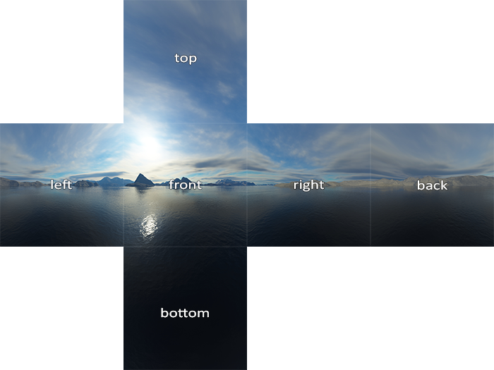

# Equirectangular to Cubemap Converter

A lightweight C++23 tool using OpenCV to convert spherical (equirectangular) video streams into a standard 4x3 Horizontal Cubemap Cross layout.

## Features
- **C++23 & OpenCV:** Optimized backward-mapping transformation using `remap`.
- **Toroidal Continuity:** Seamless edges using OpenCV's `BORDER_WRAP`.
- **Dual Output Modes:**
  - **GUI Preview (Default):** Real-time window display scaled down for high-res monitors.
  - **Raw Stream (`--raw`):** Disables the GUI and pipes uncompressed binary frame data directly to `stdout` (ideal for Python or FFmpeg integrations).
- **Profiling:** Simple terminal frame-time counter.

## Cubemap Cross Layout


## Prerequisites
- **CMake** (>= 3.20)
- **C++23 Compiler** (GCC 13+, Clang 16+, or MSVC 2022+)
- **OpenCV 4.x** (with FFMPEG backend)

### Install dependencies (Ubuntu/Linux)
```bash
sudo apt update && sudo apt install build-essential cmake libopencv-dev

```

## Build Instructions

```bash
mkdir build && cd build
cmake -DCMAKE_BUILD_TYPE=Release ..
make -j$(nproc)

```

## Usage

### Interactive Preview Mode

```bash
./Equirectangular_to_Cubemap /path/to/video.mp4

```

*(If no argument is passed, it looks for `attempt.mov` in the project root. Press `q` to close).*

### Pipeline / Headless Mode

```bash
./Equirectangular_to_Cubemap /path/to/video.mp4 --raw | python3 consumer.py

```

## License

This project is licensed under the **GNU Affero General Public License v3.0** (AGPL-3.0). See the `LICENSE` file for details.